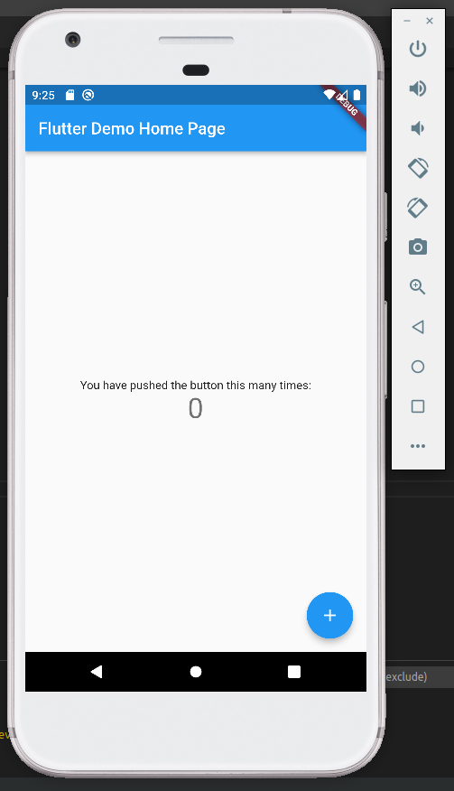

# Criando o nosso primeiro app

Agora que você já tem todas instalações necessárias, podemos começar a desenvolver o nosso primeiro projeto.

## Gerando o projeto no VS Code
Por questões de praticidade, nesse projeto, iremos utilizar o edito de textos VS Code. 

- Inicie o VS Code.
- Clique em *View -> Command Palette*.
- Digite "Flutter" e selecione **Flutter: New Aplication Project**.
- Selecione o diretório desejado para criar o projeto.
- Escolha o nome do projeto, como por exemplo, *meuapp*.

Se o arquivo *main.dart* abrir, parabéns! O seu primeiro projeto em Flutter está criado.

## Rodando o app
- Procure o a barra de acesso do VS Code
- Selecione o dispositivo desejado. Caso não haja nenhum, selecione **No devices**.
- Rode o projeto na opção *Start Debugging*.

Você deve ter visto uma tela parecida com essa no seu dispositivo. Vamos começar a programar, enfim!


## Primeiras mudanças
Localize o seguinte trecho do arquivo *main.dart*:
```
const Text(
              'You have pushed the button this many times:',
            ),
```

Mude a palavra "pushed" para "clicked", da seguinte maneira:
```
const Text(
              'You have clicked the button this many times:',
            ),
```

Em seguida, salve o arquivo. A mudança deve ter sido feita, sem nenhum tipo de reload.

---
**OBSERVAÇÃO**

O Flutter oferece um sistema de desenvolvimento rápido chamado Stateful Hot Reload, que possui a habilidade de alterar um código sem ter que reiniciá-lo.

---
