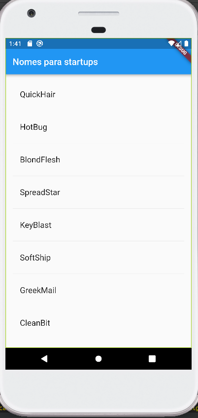

# Finalizando a página

Vamos finalizar o nosso aplicativo. Com a base que temos, basta disponibilizarmos mais alguns nomes na tela para completar a missão.

## Adicionando Widgets
Há 2 maneiras de um *widget* ser definido:

- **Widgets com estados:** Propriedades poderão ser alteradas ao longo do desenvolvimento do projeto, enquanto essa widget existir.
- **Widgets sem estados:** Nenhuma propriedade poderá ser alterada, ou seja, são valores imutáveis.

Tendo isso como base, vamos implementar um widget com estados (*Stateful Widget*), ```RandomWords```, que cria a classe ```_RandomWordsState```. Além disso, a classe ```RandomWords``` será usada como filha (herança) na classe ```MyApp```.

Para começar o nosso widget, abra novamente o arquivo *main.dart*, pule 2 linhas e digite a palavra ```stful```. O VS Code irá te sugerir criar uma *Stateful Widget*, e então selecione a opção! Você irá se deparar com o seguinte código:

```dart
class  extends StatefulWidget {
  const ({ Key? key }) : super(key: key);

  @override
  _State createState() => _State();
}

class _State extends State<> {
  @override
  Widget build(BuildContext context) {
    return Container(
      
    );
  }
}
```

Perceba que o editor já deixou selecionado na frente da palavra ```class```. Isso acontece justamente para você definir o nome da sua classe, que no nosso caso se chamará ```RandomWords``` (conforme combinado). Perceba que a classe ```_RandomWordsState``` também foi criada após você colocar o nome! O *underscore* é imposto por padrão pelo Dart. Considere por esse sinal em classes do tipo ```state``` como uma boa prática. Suas classes devem estar assim:

```dart
class RandomWords extends StatefulWidget {
  @override
  _RandomWordsState createState() => _RandomWordsState();
}

class _RandomWordsState extends State<RandomWords> {
  @override
  Widget build(BuildContext context) {
    return Container();
  }
}
```

Altere o método ```build()``` com as seguintes linhas:

```dart
class _RandomWordsState extends State<RandomWords> {
    @override
    Widget build(BuildContext context) {
      final wordPair = WordPair.random();   //Sorteando um n
      return Text(wordPair.asPascalCase);
    }
  }
```

Para finalizar, no código inicial, altere o ```child```. De ```Text(wordPair.asPascalCase)``` para ```RandomWords()```. Lembrando que essa configuração que foi trocada já foi definida na nossa classe ```_RandomWordsState```. O resultado na tela deve ser o mesmo de antes. Vamos, enfim, adicionar as mudanças.


## Criando uma barra de deslocamento

No último passo da etapa 3, vamos expandir a classe ```_RandomWordsState``` para ela disponibilizar vários nomes, ao invés de apenas um. Comece as mudanças criando uma lista de sugestões para salvar os pares de nomes gerados. Vamos também adicionar uma variável para aumentar a letra que aparece na tela.

```dart
class _RandomWordsState extends State<RandomWords> {
  final _suggestions = <WordPair>[];
  final _biggerFont = const TextStyle(fontSize: 18.0);
  // ···
}
```

O próximo passo será adicionar outra função! Vamos criar a ```BuildSugestions()```, que criará a nossa ```ListView()``` (função que exibe as palavras).

A classe ```ListView()``` possui um construtor, ```ItemBuilder()```, que entra como uma função anônima. Essa função recebe 2 parâmetros:

- ```BuildContext```: passa o contexto para o construtor
- Iterador ```i```: começa no 0 e vai aumentando o valor 2 vezes a cada vez que a função é chamada


Vamos por a mão na massa! Adicione o método ```_buildSugestions()``` na nossa classe ```_RandomWordsState```:

```dart
Widget _buildSuggestions() {
  return ListView.builder(
      padding: const EdgeInsets.all(16.0),
      itemBuilder: /*1*/ (context, i) {
        if (i.isOdd) return const Divider(); /*2*/

        final index = i ~/ 2; /*3*/
        if (index >= _suggestions.length) {
          _suggestions.addAll(generateWordPairs().take(10)); /*4*/
        }
        return _buildRow(_suggestions[index]);
      });
}
```

### Observações sobre o código acima
- **/*1*/:** O ```itemBuilder``` é chamado a cada combinação de palavras,  e deixa cada sugestão na coluna ```ListTitle```. Para colunas **pares**, a função adiciona uma coluna ```ListTitle``` por combinação. Para colunas **ímpares**, a função adiciona um uma widget divisora para separas as entradas visualmente. 
- **/*2*/:** Adiciona um widget divisor de um pixel de altura em ```ListView```.
- **/*3*/:** A operação ```i ~/ 2``` divide o i por 2, e retorno um resultado **inteiro**. Esse trecho, então, calcula o número de combinações na ```ListView```, menos as widgets divisoras.
- **/*4*/:**Caso você use todas palavras generadas, ele gera mais 10 novas e adiciona na lista de sugestões.

Vamos adicionar agora o método para criar as linhas! O método ```_buildRow```!

```dart
Widget _buildRow(WordPair pair) {
  return ListTile(
    title: Text(
      pair.asPascalCase,
      style: _biggerFont,
    ),
  );
}
```

Mais uma vez na classe ```_RandomWordsState```, vamos atualizar o método ```_build()``` para incorporar a lista de sugestões! Ao invés de apenas chamar a biblioteca, que nem estavamos fazendo até agora, a lista disponibilizará mais de um nome na tela. Substitua o método body:

```dart
@override
Widget build(BuildContext context) {
  return Scaffold(
    appBar: AppBar(
      title: const Text('Nomes para startups'),
    ),
    body: _buildSuggestions(),
  );
}
```

Para finalizar, vamos entrar na classe principal do app (```MyApp()```) para aplicar nossas mudanças.

```dart
class MyApp extends StatelessWidget {
  // #docregion build
  @override
  Widget build(BuildContext context) {
    return MaterialApp(
      title: 'Startup Name Generator',
      home: RandomWords(),    //Mudamos o home para chamar a classe RandomWords(), que já contem dados como titulo, etc
    );
  }
```

Feito todos passos, o seu app deve ter uma cara assim:


Pronto! Nosso app está pronto! No próximo passo, vamos tornar essa página interativa. Como? Acesse [esse link](https://jonathansutton1.github.io/TecWeb-Projeto3/P4/).